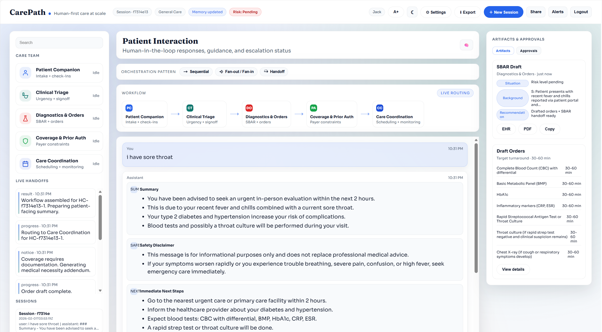

# CarePath - Human-first care at scale

Amplifying human-led care with transparent, multi-agent collaboration, built on Foundry Agent and Microsoft Agent Framework.

## What it is
CarePath showcases five collaborating agents that route a patient's intake through triage, drafting orders, coverage verification, and care coordination, while keeping a human-in-the-loop gate for clinical decisions.

## Screenshots
Light theme


Dark theme


## Key capabilities
- Preview mode with synthetic data (no login required).
- User registration + login with JWT auth.
- Session persistence per user (SQLite) with auto-resume.
- Live orchestration patterns (Sequential, Fan-out/Fan-in, Handoff).
- Artifact panel updates in real time.
- Memory summary drawer for session context.
- Dark mode toggle + large-text toggle (A+).

## Agents
1. Patient Companion - Intake, education, check-ins (no clinical disposition).
2. Clinical Triage - Proposes urgency + disposition (requires RN/MD signoff).
3. Diagnostics & Orders - Draft orders, SBAR handoff, contraindications.
4. Coverage & Prior Auth - Coverage rules + documentation requirements.
5. Care Coordination - Scheduling, logistics, follow-up monitoring.

## Workflow patterns (ASCII)

Sequential
```
Patient -> Triage -> Diagnostics -> Coverage -> Coordination
```

Fan-out / Fan-in
```
Patient -> Triage
              |-> Diagnostics \
              |-> Coverage     -> Coordination (refine + finalize)
              \-> Coordination/
```

Handoff (looping ownership)
```
Patient -> Triage -> Diagnostics -> Coverage -> Coordination
             ^         ^             |
             |         |             |
             \- review + addendum ---/
                         |
                   Patient follow-up
```

## Project structure
- backend/               FastAPI backend + WebSocket streaming
- healthcare_lab/        Agent Framework module (5-agent orchestration)
- ui/                    UI (served by backend)
- lab.env.sample         Example env values

## Requirements
- Python 3.10+
- Microsoft Agent Framework (`agent_framework`)
- SQLite (file-based, included with Python)

## Setup (Windows PowerShell)
```powershell
cd "C:\Users\cezhan\OneDrive - Microsoft\Desktop\demo\healthcare_lab_demo\backend"
python -m venv .venv
. .\.venv\Scripts\Activate.ps1
pip install -r requirements.txt
```

Install Agent Framework (from PyPI):
```powershell
pip install agent-framework
```

Create `.env` in `backend/` (copy `.env.sample`):
```powershell
Copy-Item .env.sample .env
```
Use `backend/.env.sample` as the template for your local `.env`.

Update Azure OpenAI values in `.env`, then run:
```powershell
python app.py
```

Open the UI:
http://127.0.0.1:7000

## Auth + preview mode
- Preview mode lets anyone explore synthetic data without logging in.
- Sign in to run agents, save sessions, and export artifacts.
- New Session is disabled in preview mode and enabled after login.

## Technical implementation details

### User creation + authentication
- Storage: `backend/carepath.db` (SQLite) with a `users` table.
- Passwords: hashed with `bcrypt`.
- Tokens: JWT (24h expiry) via `python-jose`, stored in browser localStorage.
- API endpoints:
  - `POST /api/register` - create user (email + password + optional display_name)
  - `POST /api/login` - authenticate and return JWT + user
  - `GET /api/me` - return user profile (auth required)
  - `PUT /api/settings` - update display name/email (auth required)
- WebSocket auth: first WS message must include `access_token`; invalid token returns `auth_error` and closes connection (code 1008).

### Session persistence
- Storage: `sessions`, `messages`, `artifacts`, `handoffs` tables in SQLite.
- Auto-resume: on login, UI requests `/api/sessions/latest` and hydrates UI.
- Session list: `/api/sessions` returns recent sessions for the left panel list.
- Create new: `POST /api/sessions` returns a new session id.
- Append events: `POST /api/sessions/{id}/events` persists:
  - `message` (role + content)
  - `artifact` (type + JSON payload)
  - `handoff` (kind + content)

### Memory management (lightweight)
- Stored in `sessions.summary` as a rolling digest of recent messages.
- Updated on each `message` event (no LLM calls).
- Visible in the memory drawer (memory button).

## Session management + memory
- Sessions are persisted per user in SQLite and auto-resume after login.
- Session list shows preview text (from summary) in the left panel.
- Memory drawer shows the rolling session summary.
- Summary is lightweight (recent message digest) and updates on each message.

## UI controls
- Dark mode toggle in the header.
- Large text toggle (A+) for patient-friendly readability.

## Using the demo
1) Pick a workflow pattern (Sequential, Fan-out/Fan-in, Handoff).
2) Enter a patient symptom (e.g., "I have a fever and chills").
3) Watch agent handoffs + artifacts update in real time.

## Notes
- The UI expects the backend at http://127.0.0.1:7000.
- Demo mode uses simulated EHR + payer data; it is not clinical advice.
- Use `backend/.env.sample` as the template for your local `.env`.
