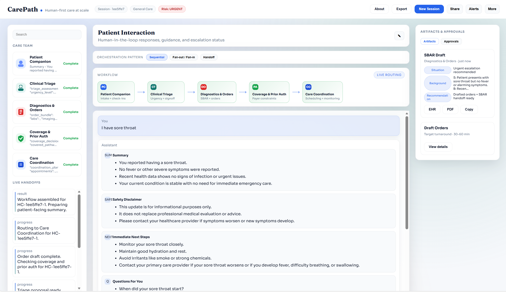

# CarePath - Human-first care at scale

Amplifying human-led care with transparent, multi-agent collaboration, built on Foundry Agent and Microsoft Agent Framework.

## What it is
CarePath showcases five collaborating agents that route a patient's intake through triage, drafting orders, coverage verification, and care coordination, while keeping a human-in-the-loop gate for clinical decisions.

## Screenshot


## Agents
1. Patient Companion - Intake, education, check-ins (no clinical disposition).
2. Clinical Triage - Proposes urgency + disposition (requires RN/MD signoff).
3. Diagnostics & Orders - Draft orders, SBAR handoff, contraindications.
4. Coverage & Prior Auth - Coverage rules + documentation requirements.
5. Care Coordination - Scheduling, logistics, follow-up monitoring.

## Workflow patterns (ASCII)

Sequential
```
Patient -> Triage -> Diagnostics -> Coverage -> Coordination
```

Fan-out / Fan-in
```
Patient -> Triage
              |-> Diagnostics \
              |-> Coverage     -> Coordination (refine + finalize)
              \-> Coordination/
```

Handoff (looping ownership)
```
Patient -> Triage -> Diagnostics -> Coverage -> Coordination
             ^         ^             |
             |         |             |
             \- review + addendum ---/
                         |
                   Patient follow-up
```

## Project structure
- backend/               FastAPI backend + WebSocket streaming
- healthcare_lab/        Agent Framework module (5-agent orchestration)
- ui/                    UI (served by backend)
- lab.env.sample         Example env values

## Requirements
- Python 3.10+
- Microsoft Agent Framework (`agent_framework`)

## Setup (Windows PowerShell)
```powershell
cd "C:\Users\cezhan\OneDrive - Microsoft\Desktop\demo\healthcare_lab_demo\backend"
python -m venv .venv
. .\.venv\Scripts\Activate.ps1
pip install -r requirements.txt
```

Install Agent Framework (from PyPI):
```powershell
pip install agent-framework
```

Create `.env` in `backend/` (copy `.env.sample`):
```powershell
Copy-Item .env.sample .env
```
Use `backend/.env.sample` as the template for your local `.env`.

Update Azure OpenAI values in `.env`, then run:
```powershell
python app.py
```

Open the UI:
http://127.0.0.1:7000

## Using the demo
1) Pick a workflow pattern (Sequential, Fan-out/Fan-in, Handoff).
2) Enter a patient symptom (e.g., "I have a fever and chills").
3) Watch agent handoffs + artifacts update in real time.

## Notes
- The UI expects the backend at http://127.0.0.1:7000.
- Demo mode uses simulated EHR + payer data; it is not clinical advice.
- Use `backend/.env.sample` as the template for your local `.env`.
